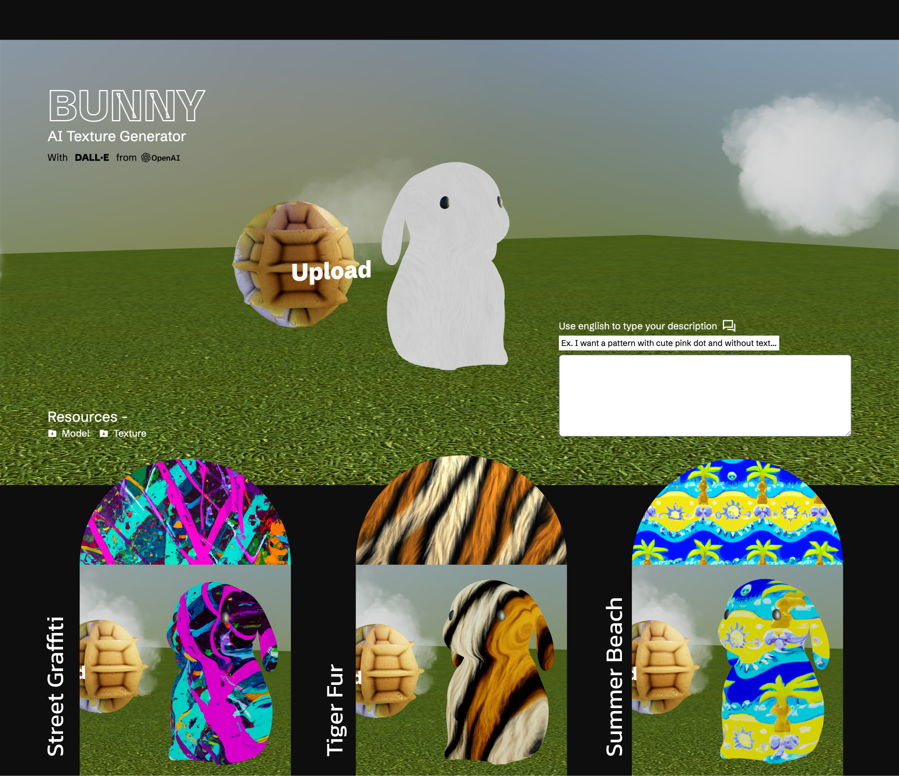

# React Three Fiber with AI Texture 🐰

This project is a practice for **React Three Fiber (R3F)**, combining it with **OpenAI's DALL·E 2** to generate AI textures for a 3D rabbit model based on the input prompt!



## Client

Built with **TypeScript** and powered by **React Three Fiber** as the 3D engine. The following tools and libraries are used:

- **[valtio](https://github.com/pmndrs/valtio)**: State management for efficient updates in the app.
- **[Tailwind CSS](https://tailwindcss.com/)**: Utility-first CSS framework for rapid styling.

## Server

The server is built using **Node.js** with **Express**, which connects to the **OpenAI** library to generate images through DALL·E 2.

- **Introduction**: [DALL·E 2: Image Generation](https://openai.com/research/dall-e)
- **Documentation**: [DALL·E 2 Image Generation Guide](https://platform.openai.com/docs/guides/images/image-generation-beta)

```bash
OPENAI_API_KEY="your_api_key_here"
```

Now, you're ready to generate 3D rabbit textures powered by AI! 🐇✨
